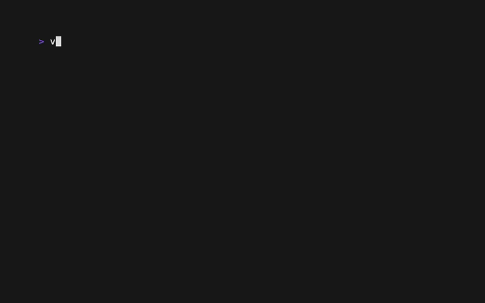

<div align="center">

```
 ██╗   ██╗  █████╗  ██╗      ██╗       █████╗
 ██║   ██║ ██╔══██╗ ██║      ██║      ██╔══██╗
 ██║   ██║ ███████║ ██║      ██║      ███████║
 ╚██╗ ██╔╝ ██╔══██║ ██║      ██║      ██╔══██║
  ╚████╔╝  ██║  ██║ ███████╗ ███████╗ ██║  ██║
   ╚═══╝   ╚═╝  ╚═╝ ╚══════╝ ╚══════╝ ╚═╝  ╚═╝
```

**Scaffold your full stack in seconds.**

[](https://www.npmjs.com/package/valla-cli)
[](https://github.com/tariktz/valla/actions/workflows/ci.yml)
[](go.mod)
[](LICENSE)



</div>

---

Stop wiring up frontend, backend, database, and Docker by hand. Valla scaffolds your entire stack in one terminal flow — pick your frameworks, hit Enter, and get a production-ready project structure with environment config, Docker Compose, and local HTTPS included.

**[→ Full documentation](https://tariktz.github.io/valla/)**

## Features

| | |
|---|---|
| **Scaffold** | Interactive TUI — choose frontend, backend, database, and ORM. Generates a complete project with `.env` and Docker Compose wired up. |
| **Fully Dockerized** | Packages never touch your host machine. Everything runs inside a Docker dev container; your source files are the only thing on disk. |
| **Secure Serve** | `valla serve` turns any local port into a trusted HTTPS URL. One-time setup, no config files, HMR and WebSockets work out of the box. |

## Quickstart

```bash
# Scaffold a project
npx valla-cli

# Set up local HTTPS (once per machine)
npx valla-cli trust

# Proxy local services behind HTTPS
valla serve --name myapp --map "ui:3000,api:8080"
# → https://ui.myapp.test
# → https://api.myapp.test
```

## Supported stacks

### Frontend

| Framework | Node | Bun | Server-side |
|---|:---:|:---:|:---:|
| React | ✓ | ✓ | |
| Vue | ✓ | ✓ | |
| Angular | ✓ | ✓ | |
| Svelte (SvelteKit) | ✓ | ✓ | ✓ |
| Astro | ✓ | ✓ | ✓ |
| Next.js | ✓ | ✓ | ✓ |
| TanStack Start | ✓ | ✓ | ✓ |

### Backend

| Language | Framework |
|---|---|
| Go | Gin, Fiber, Boilerplate |
| Node.js | Express, NestJS, Boilerplate |
| Python | FastAPI, Flask, Django |
| .NET | ASP.NET Core Web API, Minimal API |
| Java | Spring Boot (Maven/Gradle), Quarkus (Maven/Gradle) |

### Database

PostgreSQL · MySQL · MariaDB · MongoDB · Redis · SQLite

### ORM _(Node.js + SQL stacks)_

Prisma · Drizzle

## Requirements

> `npx valla-cli` downloads a pre-built binary — Go is not required.

- **Node.js** — frontend scaffolds and Node backends
- **Docker** — Docker mode and Fully Dockerized dev environments
- **Go** — building or running from source only

## Contributing

See [CONTRIBUTING](https://tariktz.github.io/valla/contributing) in the docs, or clone and run tests:

```bash
git clone https://github.com/tariktz/valla
cd valla
go test ./...
```

Open an [issue](https://github.com/tariktz/valla/issues) before large PRs.

## Status

Available on npm — `npx valla-cli`. See [Releases](https://github.com/tariktz/valla/releases) for the changelog.
