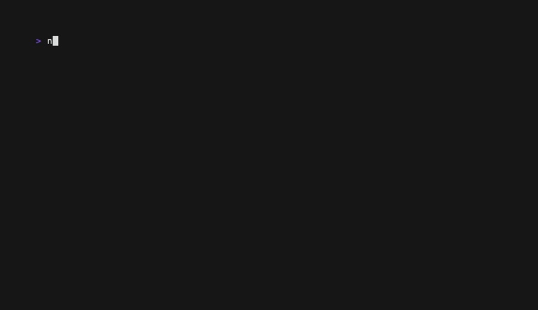

# valla-cli

Stop assembling stacks by hand. `valla-cli` scaffolds frontend, backend, database, and Docker wiring in a single interactive flow — from zero to a running project in minutes.

**Fully Dockerized dev environments included** — choose the Fully Dockerized output mode and all your dependencies (`node_modules`, virtual envs) live inside Docker. Your host machine only ever sees source files. When a compromised package runs a malicious install script, it's contained to the container and can't touch your SSH keys or system files.

Open source — contributions welcome at [github.com/tariktz/valla](https://github.com/tariktz/valla).



## Usage

```bash
npx valla-cli
```

Or install globally:

```bash
npm install -g valla-cli
valla-cli
```

On first run, the correct pre-built binary for your platform is downloaded and cached automatically. **No Go installation required.**

- macOS/Linux: `~/.cache/valla-cli/`
- Windows: `%LOCALAPPDATA%\valla-cli\`

## What It Does

- **Fully Dockerized mode** — dependencies install inside Docker, never on your host machine; protects against supply chain attacks
- Scaffolds frontend and backend together in a single interactive terminal flow
- Generates `.env` for local development
- Generates `docker-compose.yml` for containerized development
- Wires frontend API defaults to the selected backend port automatically
- Injects backend CORS configuration for supported backends
- Supports monorepo, separate-folder, frontend-only, and backend-only output modes
- Includes a dedicated WordPress mode with Docker services and a starter theme
- Supports multiple databases simultaneously (e.g. PostgreSQL + Redis)
- Optionally generates ORM configuration files (Prisma or Drizzle) for eligible stacks
- **`valla serve` — zero-config local HTTPS reverse proxy** with a trusted certificate, multi-service subdomain routing, and an optional interactive dashboard

## How It Works

The CLI walks through a short set of prompts:

1. Project name
2. Output structure (Fully Dockerized, monorepo, separate folders, WordPress, and more)
3. Frontend runtime and framework
4. Backend runtime and framework
5. Database (multi-select — combine PostgreSQL, MySQL, MariaDB, MongoDB, Redis, or pick SQLite/None)
6. ORM selection (Prisma, Drizzle, or None — shown only for eligible stacks)
7. Local `.env` or Docker Compose
8. Optional port overrides
9. Confirmation and scaffolding

For WordPress, the CLI downloads the latest WordPress source, prepares Docker services, and creates a starter theme.


## Secure Serve

`valla trust` + `valla serve` give every local service a real HTTPS URL with a green padlock — no `/etc/hosts` edits, no manual `openssl`, no CORS headaches.

```bash
# One-time: install the local CA in your browser's trust store
sudo npx valla-cli trust

# Single service
npx valla-cli serve 5500
#  → https://port5500.valla.test

# Multi-service with named subdomains
npx valla-cli serve --name myapp --map "ui:3000,api:8080"
#  → https://ui.myapp.test
#  → https://api.myapp.test

# Load routes from valla.yaml in the current directory
npx valla-cli serve

# Interactive dashboard (health checks, request log, keyboard shortcuts)
npx valla-cli serve --name myapp --map "ui:3000,api:8080" --ui
```

See the [full documentation](https://github.com/tariktz/valla#secure-serve--zero-config-local-https) for `valla.yaml` config, `--range`, `--expose`, and TLD notes.

## Supported Stacks

**Frontend:** React, Vue, Angular, Svelte (SvelteKit), Astro, Next.js, TanStack Start — each available with Node or Bun runtime

**Backend:** Go (Gin, Fiber, Boilerplate), Node.js (Express, NestJS, Boilerplate), Python (FastAPI, Flask, Django), .NET (ASP.NET Core Web API, Minimal API), Java (Spring Boot Maven/Gradle, Quarkus Maven/Gradle)

**Database:** PostgreSQL, MySQL, MariaDB, MongoDB, Redis, SQLite — multiple databases can be selected simultaneously

**ORM _(optional)_:** Prisma or Drizzle — available when a SQL database is selected with a Node.js runtime or server-side frontend framework

**Output modes:** Fully Dockerized, Monorepo, Separate folders, Frontend only, Backend only, WordPress

## Generated Project Shapes

**Fully Dockerized:**
```
my-app/
├── frontend/
├── backend/
├── .devcontainer/
│   └── devcontainer.json
├── docker-compose.dev.yml
├── docker-compose.yml
├── Makefile
└── .env
```

**Monorepo:**
```
my-app/
├── frontend/
├── backend/
├── .env
└── docker-compose.yml
```

**Monorepo with Prisma:**
```
my-app/
├── frontend/
├── backend/
│   ├── prisma/
│   │   └── schema.prisma
│   └── prisma.config.ts
├── .env               ← includes DATABASE_URL
└── docker-compose.yml
```

**Separate folders:**
```
my-app-frontend/
my-app-backend/
.env
docker-compose.yml
```

**WordPress:**
```
my-wordpress-project/
├── .env
├── docker-compose.yml
└── wordpress/
    └── wp-content/
        └── themes/
            └── my-wordpress-project/
```

## Supported Platforms

| OS      | x64 | arm64 |
|---------|:---:|:-----:|
| macOS   |  ✓  |   ✓   |
| Linux   |  ✓  |   ✓   |
| Windows |  ✓  |   ✓   |

## Requirements

> Go is **not** required — the npm wrapper downloads the correct binary automatically.

Install only what your selected stack needs:

- **Node.js** — required for frontend scaffolds and Node-based backends
- **Docker Desktop or Docker Engine** — required for Docker mode
- **Internet access** — required for framework scaffolders and WordPress downloads

## More

Full documentation, architecture details, and contribution guide: [github.com/tariktz/valla](https://github.com/tariktz/valla)
